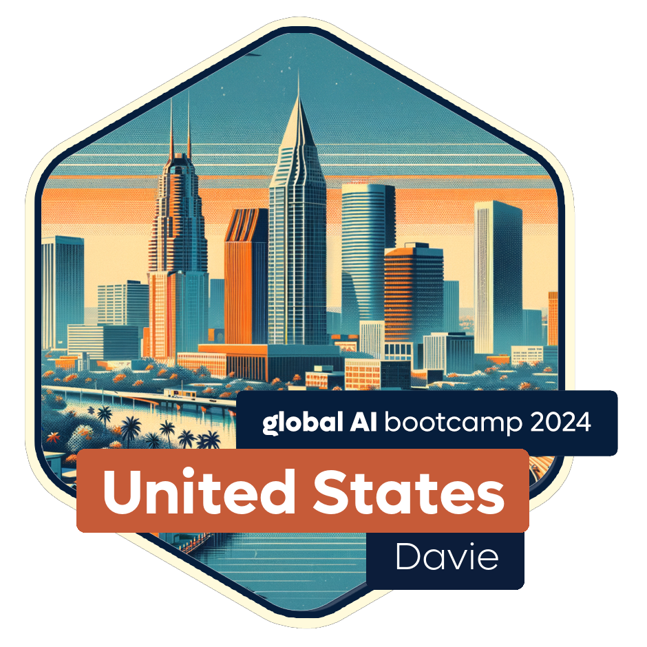

# Global AI Workshop - NSU - Davie FL
# - South Florida, March 2024
## David Cobb, Azure MCT


## Find all resources at:
## https://aiworkshop.info/




<button onclick="document.querySelectorAll('section').forEach((e) => e.classList.toggle('invert'))">Toggle appearance</button>

---


# First, thank you!

### Thank you to the volunteers of these amazing South Florida Meetups!

- **DataGeeks.org - Sponsor of 🥯☕**
- [South Florida Generative AI User Group](https://www.meetup.com/southfloridagenaiug/)
- [Florida JS](https://www.meetup.com/floridajs/)
- [Florida Dotnet](https://www.meetup.com/fladotnet/)
- [Microsoft Cloud South Florida](https://www.meetup.com/mcsfug/)
- [AI ChatGPT for Business](https://www.meetup.com/boca-area-ai-chatgpt-for-business/)

---

### Today's Agenda & Speakers

- **9:00am-10:00am:** Welcome, Keynote & Announcements
  
- **10:00am-11:30am:**  
  - **David Cobb** - Hands-On OpenAI Workshop (LAPTOP REQUIRED)
  - [AI Workshop for attendees](https://globalaicommunity.github.io/global-ai-bootcamp-2024/workshop/)

- **11:30am-12:30pm:** Lunch Break (nearby campus food courts)

- **12:30pm-2:00pm:** 'MY AI PROJECT' Lightning Talks
    - **Robert Hellestrae** - Publishing IOS & Android phone app utilizing ChatGPT
    - **Craig Simon** - Publishing custom GPT available on the OpenAI site

- **2:00pm-4:00pm:**
  - **Jiho Sohn** - AI Video Workshop (LAPTOP REQUIRED, Microsoft and Google account REQUIRED to participate).

---

## After-Event Gathering 
Join us at **Ye Olde Falcon Pub** (2867 S University Dr, Davie, FL 33328) from **5:00pm to 7:00pm** to continue discussions on AI community

---


## David's background

- Nearly 30 years in I.T.
- MCT since 2002 teaching SQL Server
- Since 2020 teaching & consulting Azure development, data, admin & security as a freelancer
- Multiple Azure certs (including AI-102 AI Engineer 🤓 )

---


# Goals for Workshop

- Play, make mistakes, have fun
- Learn from each other & share what you know
- Discuss future community possibilities for AI in 2024


---

# Azure OpenAI Technologies of Interest in 2024

## [Semantic Kernel](https://learn.microsoft.com/en-us/semantic-kernel/overview/)

## [Prompt Flow](https://learn.microsoft.com/en-us/azure/ai-studio/how-to/prompt-flow)

## [Copilot Studio](https://learn.microsoft.com/en-us/microsoft-copilot-studio/fundamentals-get-started?tabs=web)

---
## Presentation:
[Learn how to use OpenAI models using prompt engineering](https://docs.google.com/presentation/d/12PlwRj_HyTucpfRUwe6mEf7pN6nXSe8NvZoKBNNDEEo/edit#slide=id.p1)


---

Misc

OpenAI function example, search_hotel

```
[  
    {
        "name": "search_hotels",
        "description": "Retrieves hotels from the search index based on the parameters provided",
        "parameters": {
            "type": "object",
            "properties": {
                "location": {
                    "type": "string",
                    "description": "The location of the hotel (i.e. Seattle)"
                },
                "max_price": {
                    "type": "number",
                    "description": "The maximum price for the hotel"
                },
                "features": {
                    "type": "string",
                    "description": "A comma separated list of features (i.e. beachfront, free wifi, etc.)"
                }
            },
            "required": ["location"]
        }
    }
]  